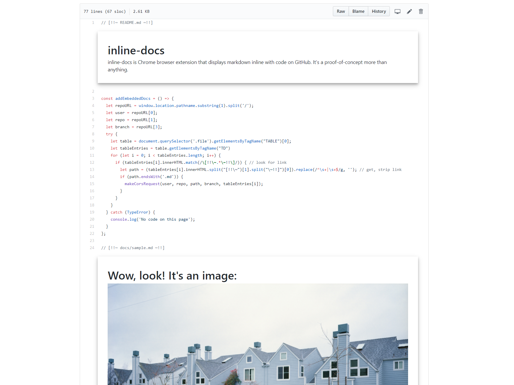

# inline-markdown
inline-markdown is Chrome browser extension that displays rendered markdown inline with code on GitHub. It's a proof-of-concept more than anything.

## Usage
Embedded markdown files must be stored within the repository. Lines with substrings of form <code>[!!~ PATH-FROM-REPO-ROOT ~!!]</code> will get markdown files and display them in the file view
